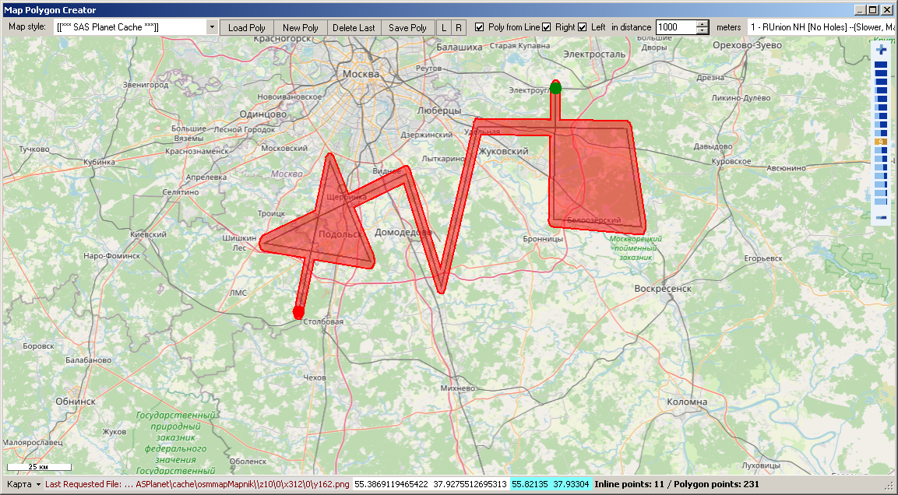
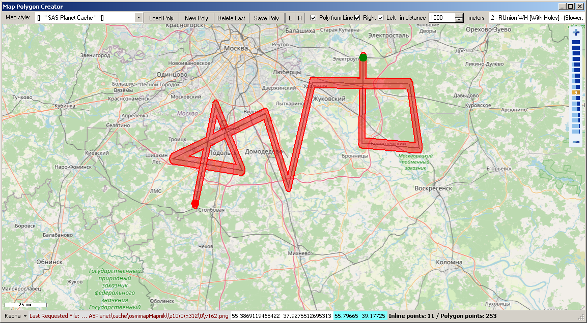
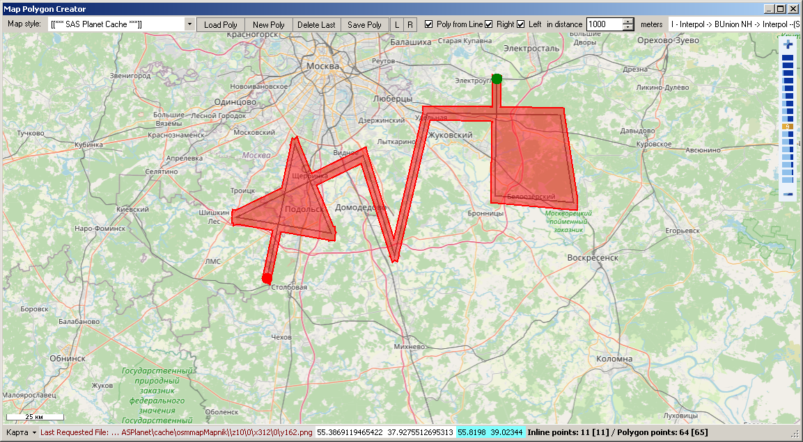
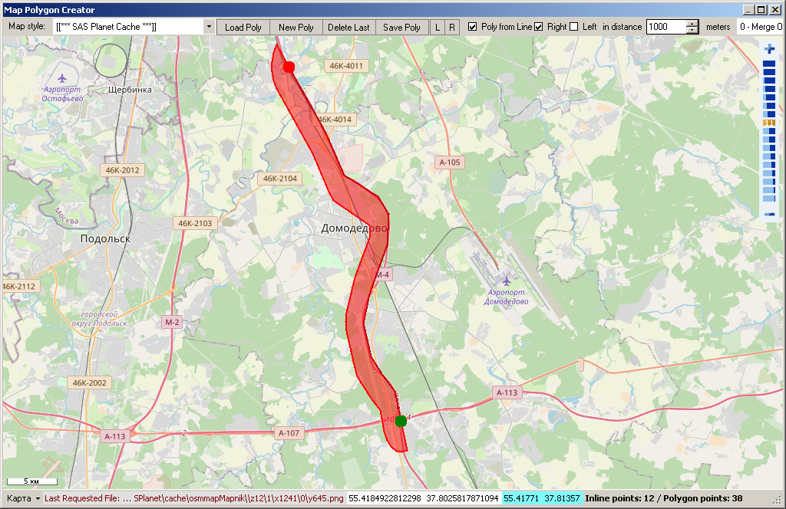
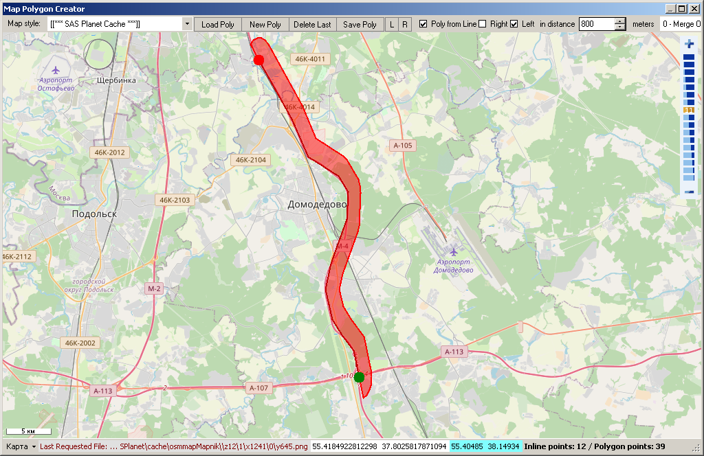

# PolygonCreator

Create (convert) polygon (zone) from kml/gpx/shp track/route/polyline or manually.    
You can use polygons in your project in filters and visualization.    
Support Tile Maps, SAS.Planet Cache & BBBike.

Создание (преобразование) полигона (зоны) из kmz/gpx/shp трека/маршрута/полилинии или вручную.   
Вы можете использовать полигоны в своих проектах в фильтрах и визуализации.
Поддреживает тайловые карты, кэш SAS.Планета и BBBike.      

More Utilites for KMZ/KML/GPX files:    
[KMZRebuilder](https://github.com/dkxce/KMZRebuilder)     
[KMZViewer](https://github.com/dkxce/KMZViewer)     
[KMZPOIfromOSM](https://github.com/dkxce/KMZPOIfromOSM)     

    
    
    
    
    